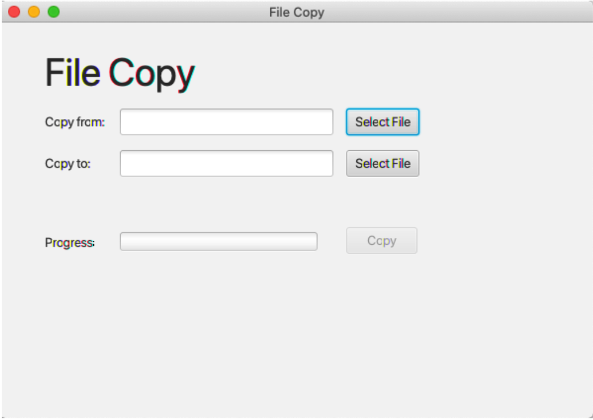
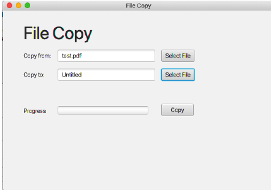
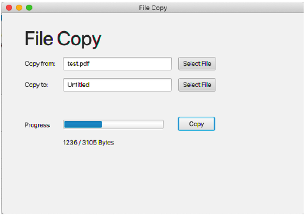
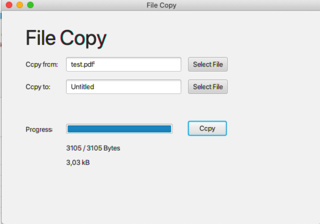

# File Copy

Ein Projekt wird bereitgestellt, welches in IntelliJ zu importieren ist!  
Folgende Dateien sind enthalten:
- **Main.java**: kann unverändert verwendet werden, Startcode für JavaFX Anwendung
- **FileCopyController.java**: Code ist zu ergänzen! Es wurden lediglich die Annotationen für die GUI-Elemente erstellt, Ereignisbehandlungen fehlen noch!
- **fileCopy.fxml**: GUI, Ereignisbehandler sind nicht eingetragen!
- **README.md**: Angabe elektronisch

## Anforderungen

- Erstelle eine JavaFX-Anwendung nach dem MVC Prinzip, mit der beliebige Files kopiert werden können.
- Sofern der User keine 2 Dateien gewählt hat, darf/kann er den Kopiervorgang nicht starten (Button inaktiv).

<div style="display: flex; justify-content: space-around; gap: 20px">


</div>

- Das Kopieren der Daten muss im Hintergrund laufen und darf die Anwendung nicht blockieren. Der User kann beliebig oft eine Datei kopieren.



- Der Fortschritt der Kopieroperation ist dem User mittels einer Progressbar anzuzeigen.
- Weiters wird der User während des Kopiervorgangs über den Fortschritt informiert (Label: "copyStatus").
- Es ist folgende Form einzuhalten:  
"x / y Bytes", wobei x ein Platzhalter für die bereits kopierte Byteanzahl ist und y für die Anzahl der insgesamt zu kopierenden Bytes steht. Bsp. „14/245“
- Der "Kopier-Thread" gibt am Ende die Anzahl der kopierten Kilobytes retour!
- Diese sind um 1 Sekunde zeitverzögert im Label „kbLabel“ anzuzeigen. Form: "x.xx kB".



## Code zum File-Chooser

Die Auswahl der Quell- und Zieldateien ist mit einem FileChooser durchzuführen. Folgender Code ist zu verwenden:

```java
fileChooser = new FileChooser();
Stage stage = (Stage) fromTextField.getScene().getWindow();
fileChooser.setTitle("Copy from File");
fileChooser.getExtensionFilters().addAll(
new FileChooser.ExtensionFilter("All Files", "*.*"));
selectedFileFrom = fileChooser.showOpenDialog(stage);
// bzw.:
selectedFileTo = fileChooser.showSaveDialog(stage);
```

## Gesamt ( / 13)

### GUI ( / 5)
- ( / 1) Erweitere die GUI um entsprechende Ereignisbehandlungen
- ( / 2) Erstelle die notwendige Bindings
- ( / 2) Anzeige der nach Beendigung des Kopiervorgangs

### Kopiervorgang ( / 8)
- ( / 2) Der Kopiervorgang muss nebenläufig sein und kann mehrfach gestartet werden
- ( / 2) Die Dateien sind byteweise zu kopieren
- ( / 2) Aktualisierung der Anzeige (Progress, sowie Fortschritt der kopierten Bytes)
- ( / 2) Zeitverzögerte Anzeige der kopierten MB
